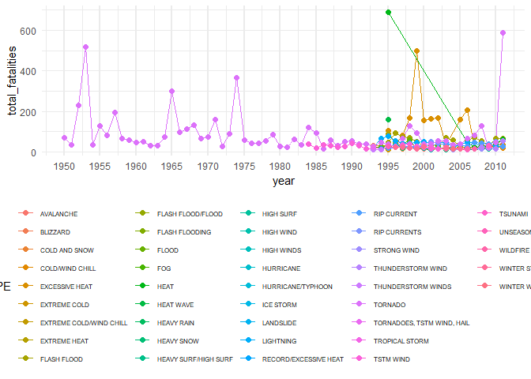

## Introduction

The purpose of this analysis is to study the correlation between different weather events in USA and the population health and economic development. This will help municipalities in the impacted regions to take the appropriate set of actions to reduce the impact of such future events.

OUr data source was collected by the NOAA organization from the year 1950 and end in November 2011.

We will be using these data to answer to the 2 following questions:

1. which type of events are most harmful to the population health
1. which type of events have the greatest economic consequences


## Data Processing

### Load and explore data from NOAA

The data is loaded from a bz2 file dump copy of the original data. 


```r
storm_data <- read.csv("./repdata-StormData.csv.bz2", stringsAsFactors = FALSE)

summary(storm_data)
```

```
##     STATE__       BGN_DATE           BGN_TIME          TIME_ZONE        
##  Min.   : 1.0   Length:902297      Length:902297      Length:902297     
##  1st Qu.:19.0   Class :character   Class :character   Class :character  
##  Median :30.0   Mode  :character   Mode  :character   Mode  :character  
##  Mean   :31.2                                                           
##  3rd Qu.:45.0                                                           
##  Max.   :95.0                                                           
##                                                                         
##      COUNTY       COUNTYNAME           STATE              EVTYPE         
##  Min.   :  0.0   Length:902297      Length:902297      Length:902297     
##  1st Qu.: 31.0   Class :character   Class :character   Class :character  
##  Median : 75.0   Mode  :character   Mode  :character   Mode  :character  
##  Mean   :100.6                                                           
##  3rd Qu.:131.0                                                           
##  Max.   :873.0                                                           
##                                                                          
##    BGN_RANGE          BGN_AZI           BGN_LOCATI       
##  Min.   :   0.000   Length:902297      Length:902297     
##  1st Qu.:   0.000   Class :character   Class :character  
##  Median :   0.000   Mode  :character   Mode  :character  
##  Mean   :   1.484                                        
##  3rd Qu.:   1.000                                        
##  Max.   :3749.000                                        
##                                                          
##    END_DATE           END_TIME           COUNTY_END COUNTYENDN    
##  Length:902297      Length:902297      Min.   :0    Mode:logical  
##  Class :character   Class :character   1st Qu.:0    NA's:902297   
##  Mode  :character   Mode  :character   Median :0                  
##                                        Mean   :0                  
##                                        3rd Qu.:0                  
##                                        Max.   :0                  
##                                                                   
##    END_RANGE          END_AZI           END_LOCATI       
##  Min.   :  0.0000   Length:902297      Length:902297     
##  1st Qu.:  0.0000   Class :character   Class :character  
##  Median :  0.0000   Mode  :character   Mode  :character  
##  Mean   :  0.9862                                        
##  3rd Qu.:  0.0000                                        
##  Max.   :925.0000                                        
##                                                          
##      LENGTH              WIDTH                F               MAG         
##  Min.   :   0.0000   Min.   :   0.000   Min.   :0.0      Min.   :    0.0  
##  1st Qu.:   0.0000   1st Qu.:   0.000   1st Qu.:0.0      1st Qu.:    0.0  
##  Median :   0.0000   Median :   0.000   Median :1.0      Median :   50.0  
##  Mean   :   0.2301   Mean   :   7.503   Mean   :0.9      Mean   :   46.9  
##  3rd Qu.:   0.0000   3rd Qu.:   0.000   3rd Qu.:1.0      3rd Qu.:   75.0  
##  Max.   :2315.0000   Max.   :4400.000   Max.   :5.0      Max.   :22000.0  
##                                         NA's   :843563                    
##    FATALITIES          INJURIES            PROPDMG       
##  Min.   :  0.0000   Min.   :   0.0000   Min.   :   0.00  
##  1st Qu.:  0.0000   1st Qu.:   0.0000   1st Qu.:   0.00  
##  Median :  0.0000   Median :   0.0000   Median :   0.00  
##  Mean   :  0.0168   Mean   :   0.1557   Mean   :  12.06  
##  3rd Qu.:  0.0000   3rd Qu.:   0.0000   3rd Qu.:   0.50  
##  Max.   :583.0000   Max.   :1700.0000   Max.   :5000.00  
##                                                          
##   PROPDMGEXP           CROPDMG         CROPDMGEXP       
##  Length:902297      Min.   :  0.000   Length:902297     
##  Class :character   1st Qu.:  0.000   Class :character  
##  Mode  :character   Median :  0.000   Mode  :character  
##                     Mean   :  1.527                     
##                     3rd Qu.:  0.000                     
##                     Max.   :990.000                     
##                                                         
##      WFO             STATEOFFIC         ZONENAMES            LATITUDE   
##  Length:902297      Length:902297      Length:902297      Min.   :   0  
##  Class :character   Class :character   Class :character   1st Qu.:2802  
##  Mode  :character   Mode  :character   Mode  :character   Median :3540  
##                                                           Mean   :2875  
##                                                           3rd Qu.:4019  
##                                                           Max.   :9706  
##                                                           NA's   :47    
##    LONGITUDE        LATITUDE_E     LONGITUDE_       REMARKS         
##  Min.   :-14451   Min.   :   0   Min.   :-14455   Length:902297     
##  1st Qu.:  7247   1st Qu.:   0   1st Qu.:     0   Class :character  
##  Median :  8707   Median :   0   Median :     0   Mode  :character  
##  Mean   :  6940   Mean   :1452   Mean   :  3509                     
##  3rd Qu.:  9605   3rd Qu.:3549   3rd Qu.:  8735                     
##  Max.   : 17124   Max.   :9706   Max.   :106220                     
##                   NA's   :40                                        
##      REFNUM      
##  Min.   :     1  
##  1st Qu.:225575  
##  Median :451149  
##  Mean   :451149  
##  3rd Qu.:676723  
##  Max.   :902297  
## 
```


### Date Transformation

The damage and casualties caused by weather events will be consolidated on **one-year** period.

This will put in light weather events having the greatest impact over the whole period and more recently.


```r
storm_data$year <- strsplit(storm_data$BGN_DATE," ")
storm_data$year <- sapply(storm_data$year, "[",1)
storm_data$year <- as.Date(storm_data$year, format = "%m/%d/%Y")
storm_data$year <- lubridate::year(storm_data$year)
```

### Fatalities and Injuries computation

```r
df_weather_impact <- NULL
df_weather_impact$population_impact_year <- storm_data %>%
  group_by(year, EVTYPE) %>%
  summarize(total_fatalities = sum(FATALITIES))

summary(df_weather_impact$population_impact_year)
```

```
##       year         EVTYPE          total_fatalities 
##  Min.   :1950   Length:2326        Min.   :  0.000  
##  1st Qu.:1995   Class :character   1st Qu.:  0.000  
##  Median :1997   Mode  :character   Median :  0.000  
##  Mean   :1997                      Mean   :  6.511  
##  3rd Qu.:2001                      3rd Qu.:  1.000  
##  Max.   :2011                      Max.   :687.000
```

```r
df_weather_impact$population_impact <- storm_data %>%
  group_by(EVTYPE) %>%
  summarize(total_fatalities = sum(FATALITIES))

summary(df_weather_impact$population_impact)
```

```
##     EVTYPE          total_fatalities 
##  Length:985         Min.   :   0.00  
##  Class :character   1st Qu.:   0.00  
##  Mode  :character   Median :   0.00  
##                     Mean   :  15.38  
##                     3rd Qu.:   0.00  
##                     Max.   :5633.00
```

```r
top20_evtype_fatalities <- df_weather_impact$population_impact[order(df_weather_impact$population_impact$total_fatalities, decreasing = TRUE)[1:20],]

print(top20_evtype_fatalities)
```

```
## # A tibble: 20 x 2
##    EVTYPE                  total_fatalities
##    <chr>                              <dbl>
##  1 TORNADO                             5633
##  2 EXCESSIVE HEAT                      1903
##  3 FLASH FLOOD                          978
##  4 HEAT                                 937
##  5 LIGHTNING                            816
##  6 TSTM WIND                            504
##  7 FLOOD                                470
##  8 RIP CURRENT                          368
##  9 HIGH WIND                            248
## 10 AVALANCHE                            224
## 11 WINTER STORM                         206
## 12 RIP CURRENTS                         204
## 13 HEAT WAVE                            172
## 14 EXTREME COLD                         160
## 15 THUNDERSTORM WIND                    133
## 16 HEAVY SNOW                           127
## 17 EXTREME COLD/WIND CHILL              125
## 18 STRONG WIND                          103
## 19 BLIZZARD                             101
## 20 HIGH SURF                            101
```


### Property Damage Computation

```r
p <- ggplot(df_weather_impact$population_impact_year[df_weather_impact$population_impact_year$total_fatalities > 12,], aes(year, colour = EVTYPE)) +
  theme_minimal() +
  theme(axis.ticks.x = element_line(colour = "blue", size = 2)) +
  theme(panel.grid.major.x = element_line(size = 1) ) +
  theme(legend.text = element_text(size = 6)) +
  theme(legend.position = "bottom") +
  geom_line(aes(y=total_fatalities)) +
  scale_x_continuous(breaks = seq(1950, 2015, 5)) +
  geom_point(aes(y=total_fatalities), size = 2)
p
```

<!-- -->

### Property Damage Computation

```r
table(storm_data$PROPDMGEXP)
```

```
## 
##             -      ?      +      0      1      2      3      4      5 
## 465934      1      8      5    216     25     13      4      4     28 
##      6      7      8      B      h      H      K      m      M 
##      4      5      1     40      1      6 424665      7  11330
```


### Crop Damage Computation

```r
table(storm_data$CROPDMGEXP)
```

```
## 
##             ?      0      2      B      k      K      m      M 
## 618413      7     19      1      9     21 281832      1   1994
```


## Results
